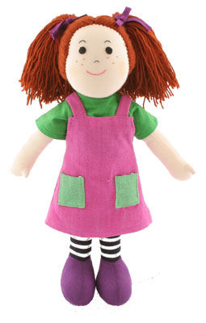
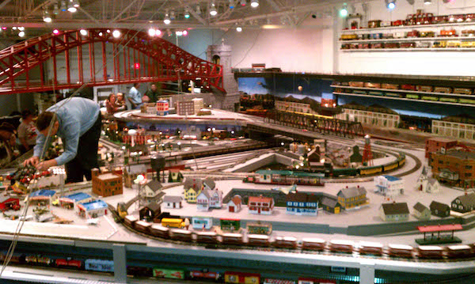

```{r setup, include=FALSE}
knitr::opts_chunk$set(echo = TRUE)
require(mosaic)
```

# What is statistics?

* [Dictionary](https://www.google.com/webhp?sourceid=chrome-instant&ion=1&espv=2&ie=UTF-8#q=What+is+statistics%3F)
    > stəˈtistiks, noun    
    > the practice or science of collecting and analyzing numerical data in large quantities, especially for the purpose of inferring proportions in a whole from those in a representative sample.
* [ASA](https://www.google.com/url?sa=t&rct=j&q=&esrc=s&source=web&cd=2&cad=rja&uact=8&ved=0ahUKEwj0o5_o4J3KAhUM6CYKHQQgCx0QFggmMAE&url=http%3A%2F%2Fwww.amstat.org%2Fcareers%2Fwhatisstatistics.cfm&usg=AFQjCNEy0X95H0sKsb7t4b2BjC8jG7bx9A&sig2=8b-gRg44n0b9xrKTs5k8nA)
    > Statistics is the science of learning from data, and of measuring, controlling, and communicating uncertainty; and it thereby provides the navigation essential for controlling the course of scientific and societal advances (Davidian, M. and Louis, T. A., 10.1126/science.1218685).
* [FSU updated 7/8/2010](http://stat.fsu.edu/undergrad/statinf2.php)
    > Statistics is the mathematical science involved in the application of quantitative principles to the collection, analysis, and presentation of numerical data. The practice of statistics utilizes data from some population in order to describe it meaningfully, to draw conclusions from it, and make informed decisions. The population may be a community, an organization, a production line, a service counter, or a phenomenon such as the weather. Statisticians determine which quantitative model is correct for a given type of problem and they decide what kinds of data should be collected and examined.
* [YouTube](https://www.youtube.com/watch?v=ooOdP1BJxLg) at 1:30s

## Descriptive Statistics

* [Wikipedia entry](https://en.wikipedia.org/wiki/Descriptive_statistics)
* Khan Academy: Descriptive statistics    
    > Measures of central tendency and dispersion. Mean, median, mode, variance, and standard deviation.
    - Measures of central tendency
        > This is the foundational tutorial for the rest of statistics. We start thinking about how you can represent a set of numbers with one number that somehow represents the "center". We then talk about the differences between populations, samples, parameters and statistics.
        
*Introductory statistics* is usually presented in terms of easy-to-calculate quantities,

* sample means
* sample counts and proportions

and two slightly harder-to-calculate quantities:

* intercept and slope of a line

### What's easy to calculate has changed

We can now calculate just about whatever we want.

        
## Models

- A **model** is a *representation for a purpose.*

 |  | [Top Gear](https://www.youtube.com/watch?v=pJdrlWR-yFM) at 5:05 - 5:55s.
---------|-----------|--------------
Human     |  Trains   | Space Shuttle

- A **mathematical model** is a model built out of mathematical entities, e.g. functions, numbers, differential equations, ...

- A **statistical model** is a mathematical model that is informed by data and statistical processes, e.g. fitting, significance, confidence intervals, ...

- Models are always **subjective**.  This is because they are properly rooted in purpose at hand for the modeler and because they depend on what the modeler knows and chooses to include.

### ~~Right and wrong~~ Useful versus Not 

> All models are wrong.  Some models are useful.   - George Box

Whether a model is useful depends on its suitability for the purpose at hand.

## Models versus Descriptive Statistics

You can think of a statistical model as a *broader framework for description* of data than means, medians, modes, proportions, and slopes.

* in models, the subjectivity is explicit.  The analyst cannot hide behind behind the curtain of "descriptive statistics."
* models are capable of represented much more complicated relationships than means, medians, modes, proportions, e.g. 
    - multiple variables are involved
    - inter-connections among variables are rich

## Example

Fire-control computer on a Fletcher-class destroyer (c 1943):

* From the director (sighting the target)
- range
- change of range
- bearing
- rate of changes in deflection and elevation
* From sensors
- wind
- humidity
- own-ship's course and speed
- condition of the guns (cold, hot, number of rounds fired)

Source: C. Snelling Robinson (2000) 200,000 *Miles aboard the Destroyer Cotton* 


## Functions and Formulas

An important form of mathematical model involves     

1. A response variable (aka dependent variable)
2. Explanatory variables (aka independent variables)
3. A function that relates them: response = $f($ explanatory vars $)$

A popular and powerful architecture for functions: low-order polynomials

* Linear: $y = a + b x + c w + ...$
* Bilinear: $y = a + b x + c w + d x w + ...$

A *formula* in R is a means of representing such relationships

* Linear: `y ~ x + w + ...`
* Bilinear: `y ~ x + w + x:w + ...` or, more concisely, `y ~ x * w + ...`

Both of these can be read as $y$ depends on $x$ and $w$.

## Functions with categorical inputs

The inputs to mathematical functions do not have to be numbers.

Example:

temperature = g(Month, State)

`g("Feb", "MN")`
`g("July", "FL")`


## Example: World Records in the 100m freestyle swim race

```{r echo = FALSE, fig.width=6, fig.height = 4, out.width = "50%"}
require(mosaic)
require(mosaicData)
basic <- ggplot(SwimRecords, aes(x=year, y=time, group=sex)) + geom_point() + ylab("Time (s)")
```

Tell me about the data:

1. Why do the data slope downwards?
2. Why are there two almost parallel sets of points?

`time` will be the response. `year` and `sex` are the explanatory variables that are available.

### The simplest architecture

`time ~ 1`

"The time does not depend on any variable. Therefore it is a constant."

```{r  echo = FALSE, fig.width=6, fig.height = 4, out.width = "50%"}
set.seed(102)
basic + geom_hline(yintercept = runif(5, 50,90), color = 2:6) + 
  geom_hline(yintercept = mean(SwimRecords$time), color="black")
```

Which of these six models is best?  The one that's "closest" to the data.

#### Fitting a model

For polynomial models, this is the job of `lm()`

```{r}
modA <- lm(time ~ 1, data = SwimRecords)
coef(modA)
```

Fitted model amounts to the mean of `time`

```{r}
mean(time, data = SwimRecords)
```

### Straight-line model

`time ~ year`

"Time depends only on the year."

```{r  echo = FALSE, fig.width=6, fig.height = 4, out.width = "50%"}
set.seed(102)
slopes <- runif(5, -1, 1)
years <- runif(5, 1920, 1980)
basic + geom_abline(intercept = runif(5,50,80) - slopes*years, slope = slopes, color=2:6) +
  geom_abline(intercept = 567.242, slope = -0.2599, col="black")
```

Fitting the model form to the data:
  
```{r}
modB <- lm(time ~ year, data=SwimRecords)
coef(modB)
```

### Time depends on sex

`time ~ sex`

```{r  echo = FALSE, fig.width=6, fig.height = 4, out.width = "50%"}
basic <- ggplot(SwimRecords, aes(x=year, y=time, color=sex)) + geom_point()
basic + 
  geom_point() + ylab("Time (s)") + 
  geom_abline(intercept = 65.19 + c(0, -10.54), slope = 0, aes(color=sex))
```

```{r}
modC <- lm(time ~ sex, data = SwimRecords)
```

Fitted model amounts to groupwise means.
```{r}
mean(time ~ sex, data = SwimRecords)
```

### Time depends on both year and sex

`time ~ year + sex`

```{r  echo = FALSE, fig.width=6, fig.height = 4, out.width = "50%"}
basic + 
  geom_abline(intercept = 555.717, slope = -0.2515) +
  geom_abline(intercept = 555.717 - 9.798, slope = -0.2515)
```


Question: Is this model suited for informing a prediction of when women will be swimming faster than men?

### Let influence of year be modulated by sex

`time ~ year + sex + year:sex`, or more concisely: `time ~ year * sex`

This is called an "interaction."

```{r  echo = FALSE, fig.width=6, fig.height = 4, out.width = "50%"}
basic + 
  geom_smooth(method = "lm", se = FALSE, data=SwimRecords)
```

Question: Is this model suited for informing a prediction of when women will be swimming faster than men?

### More complicated models 

- More variables: often essential 
- More complicated functions: turn out not to be so generally useful

#### Plausible at first, but silly in the end

```{r }
modF <- lm(time ~ poly(year, 2) * sex, data = SwimRecords)
```
```{r echo=FALSE}
modFfun <- makeFun(modF)
WithQuadratic <- SwimRecords %>% mutate(val = modFfun(year, sex))
```

```{r  echo = FALSE, fig.width=6, fig.height = 4, out.width = "50%"}
basic + 
  geom_line(aes(x=year, y = val, color=sex), data=WithQuadratic)
```

Question: Is this model suited for informing a prediction of when women will be swimming faster than men?